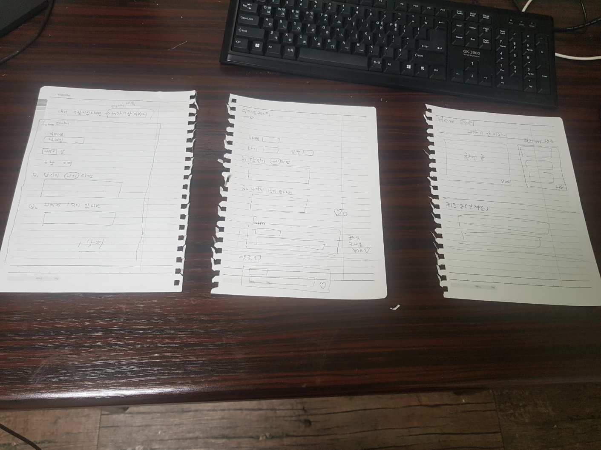

# 프로젝트 소개 

프로젝트명:  `내가 n살이라니`

 > 하게된 이유  

나는  내 나이가  n살이라면 어떤것을 했을 지  회상하는 순간을 가졌다.  
그러한 느낌을 웹사이트에 그대로 표현하고자 이 프로젝트를 계흭하게 되었다.

> 기능 

- 내가 n의 나이일때  하고 싶은 것  등록하기(자세한 것은 아래 참고) 
   - 당신의 나이가 n의 나이라면 
   - 나에게 1억이 있다면 
  
  

> 라이브러리

 - json-server 
  
    어쩌면 여기에 글을 작성하고  다시 들어올 사용자를 위해  저장할 수 있는 

    공간을 마련하기로 했습니다.

 - styled-components

    스타일링을  js방식으로 한다는 점에서 js와 일관성이 있었습니다.그리고 props를 
   
    통해 스타일을 동적으로 변경이 가능하며 , 컴포넌트처럼  재사용성 독립성을 지닙
  
    니다.

  -  React-Toastify 
   
    폼 제출 여부를 물어볼때 , 내용을 삭제할 때 , 내용을 수정할때  확인 버튼 누르고

    나오는 `알림창`인 alert 처럼 제공되는 문서를 통해 쉽게 적용할 수 있다는 점에서 

    사용하게 되었습니다.

  - React-router-dom 

    페이지들간에 이동을 보여주기 위해서  해당 라이브러리를 선택했습니다. 

  
  - React-query
  
   서버와 통신하여 데이터를  가져오는 것  , 가져오는 도중에 에러가 나올때의 흐름을  알고 싶어서 이 라이브러리를 사용하게 되었습니다. 

  > 초기 초안 
 
   

 > 사용 스택 

- 언어 
  

- 라이브러리 (`위 참고`)

- 버전 관리 도구 

> 기타 

 - 깃 커밋 컨벤션 ( <a href= "https://velog.io/@archivvonjang/Git-Commit-Message-Convention">참고</a>)

  위 사이트를 참고하여 작성합니다.

  그리고 커밋 컨벤션을 작성하게 된 이유는 컨벤션은 개발자들간에 기본적인 예의이며 , 상대방에게 정확한 메세지를 남길수 있기 때문입니다. 
   

  

